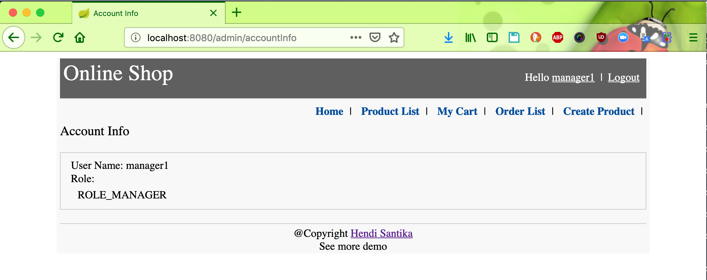

# shopping-chart
## Things to do
+ Clone repository: `git clone https://github.com/hendisantika/shopping-chart.git`
+ Go to the folder: `cd shopping-chart`
+ Run the app: `mvn clean spring-boot:run`
+ Open your favorite browser: http://localhost:8080
## Screen shot

Home Page

Login Page

Product List Page

Account Info Page

Shopping Cart Page

